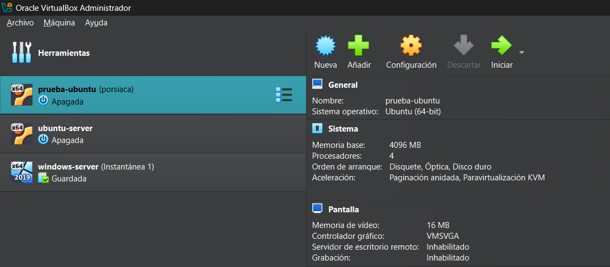
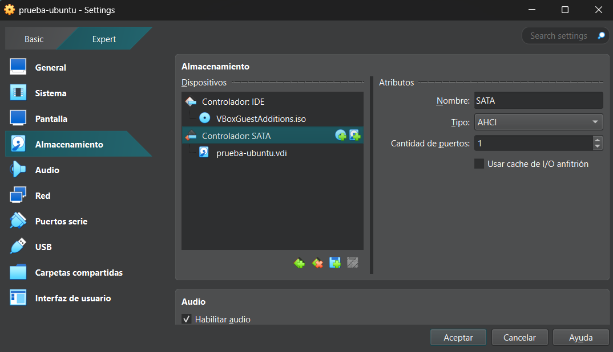
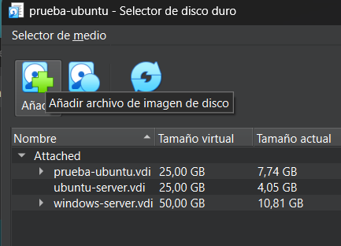
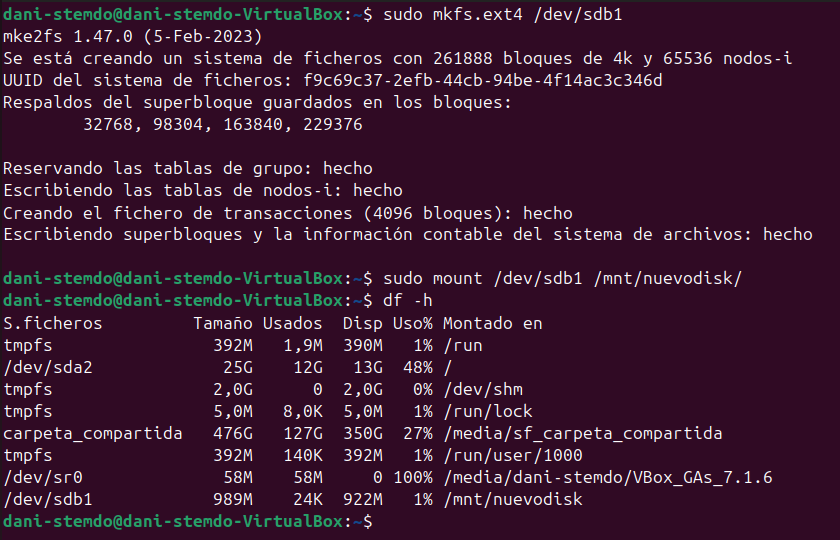

# Comos instalar un disco nuevo en Virtual box #

Primero deberemos de apagar la maquina virtual para poder instalar el disco nuevo en nuestra maquina.  

Despues nos vamos a los detales de la maquina virtual de ubuntu y le damos a configuracion. Dentro de ahi entramos en la parte de discos duros.  

  

Dentro de ahi entramos en la parte de discos duros.
  

Dentro de la configuracion de los discos le damos al segundo dibujo que tiene un mas para agregar un disco duro nuevo que no tengamos en el sistema.  
  

Despues le damos a crear disco y dentro de las opciones de la creacion del disco duro podemos elegir el tamaño que queremos que tenga el disco y el tipo de disco duro virtual.  
Una vez ya creado el disco en la maquina, le damos a iniciar la maquina ubuntu y una vez iniciada, abriremos la terminal de ubuntu y escribiremos el comando sudo fsdk -l.  
  
Y buscamos el disco que hemos añadido para recordar el nombre del disco. Despues ejecutamos el comando fdisk y la ruta del nuevo disco que por defecto es /dev/sdb. Utilizaremos las opciones n (Para crear una nueva partición) p(Para que la particion sea primaria) y al final una w(Para guardar las modificaciones que le hemos hecho al disco).  
  

Y por ultimo montaremos el disco en el sistema con el comando mount 'ruta del disco' 'directorio donde queremos que se monte el disco'.  
