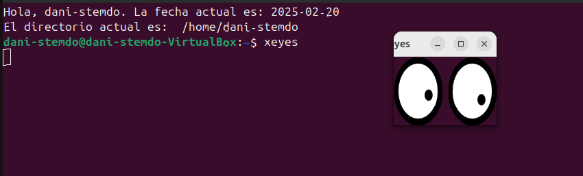
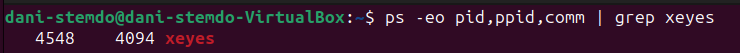
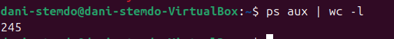
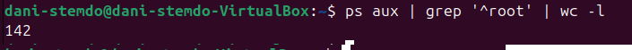
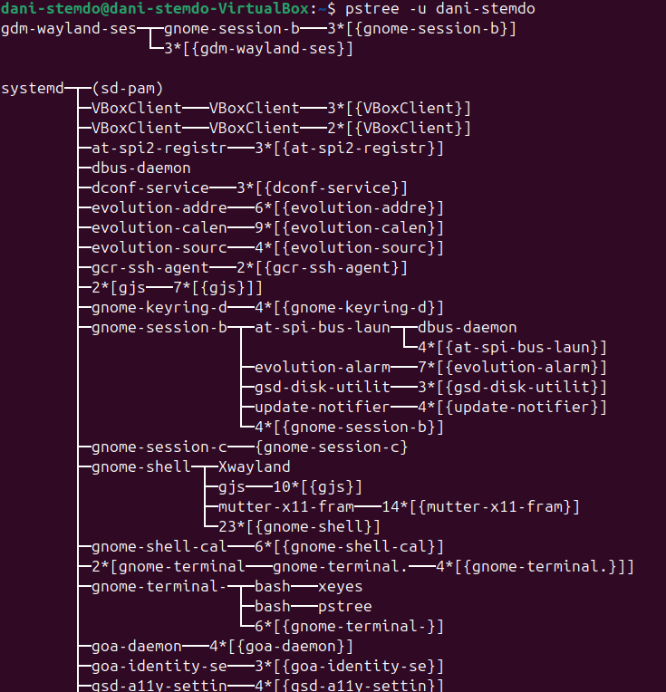
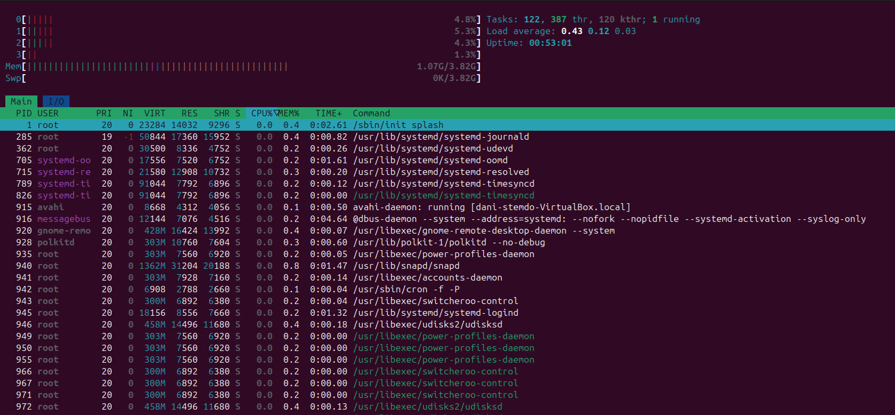
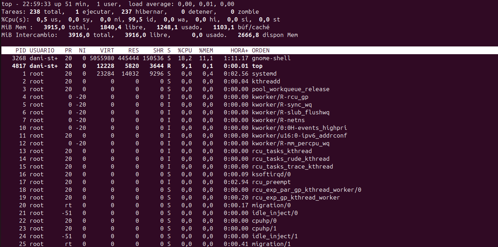
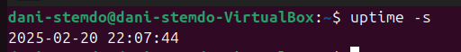

## 1ºXEYES
El comando xeyes es como un programa de unos ojos que persigue el cursor de tu raton por toda la pantalla.  
  

## 2ºIdentificador de procesos(xeyes)
¿Cuál es su PID (Process ID)? | ¿Cuál es su proceso padre (PPID - Parent Process ID)?  
Para verl el PID del xeyes deberemos de introducir el comando ps insteraremos una tuberia con un grep del comando xeyes asi cuando lo ejecutemos solo cogera toda la informacion del comando que ejecutamos nos saldra algo asi:  
  
El pid es 4548 y el ppid es 4094.

## 3º Contar procesos en ejecución  
¿Cuántos procesos hay actualmente en ejecución en el sistema?  
Actualmente en el sistema hay procesos en ejecucion 245 procesos.  
  
## 4º Procesos del usuario root  
¿Cuántos procesos pertenecen al usuario root?  
Hay 142 procesos.  
  
## 5º Jerarquía de procesos  
Descubre la jerarquía de procesos de tu usuario utilizando el siguiente comando:  
Para la jerarquia de mi usuario utilice la flag -u para poner el usuario que queria ver.  
  
## 6ºProceso con mayor consumo de CPU  
Utiliza el comando top o htop para identificar el proceso que ha consumido más tiempo de CPU.  
Esto es lo que mostrara el comando to y htop. Uno lo muestra con un formato grafico de los procesos y el otro solo con los porcentajes.

  
  

## 7º Proceso con mayor uso de memoria  
Con el comando top, averigua cuál es el proceso que está utilizando más espacio de memoria RAM.  

Por la captura anterior el proceso que mas esta utilizando la memoria ram es la shell.  

## 8º Fecha y hora de arranque del sistema  
Descubre cuándo se inició el sistema con el siguiente comando:  
Esta es la hora en la que se inicio el sistema:  
