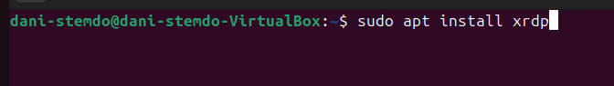
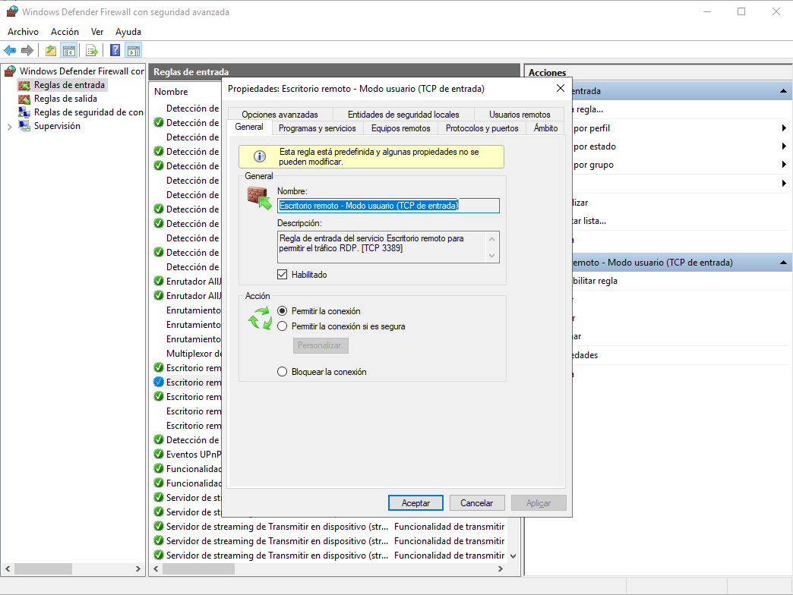

## Ejercicio 5 configuración de escritorio remoto con terminal server.  

### Configuración en ubuntu.  
Para poder hacer la configuración del escritorio remoto en ubuntu tendremos que primero instalar u paquete llamado xrdp (permite conexiones remotas).  
  
Una vez instalado este paquete podemos proceder con la comprobacion de que este paquete este activo, en caso de no estar activo deberemos de activarlo.  
Para ver si esta o no con este comando lo podremos ver:  
  
Si no nos sale activado tendremos que poner el siguiente comando para activarlo:  
  

Despues de la comprobacion del paquete tendremos que configurar el firewall y en un puerto (3389).  
Tendremos que utilizar el siguiente comando para configurarlo:  
  

Y por ultimo verificamos si se han aplicado los cambios correctamente:  

### Configuración en windows.  

Para windows es diferente aqui solo deberemos de habilitar opciones del propio windows, deberemos de habilitar la configuracion de escritorio remoto en propiedades del sistema >> Acceso remoto >> permitir las conexiones remotas a este equipo.  
  

Despues deberemos de comprobar el puerto 3389 este abierto y habilitado, deberemos de entrar en Windows defender con seguridad avanzada y buscar en reglas de entrada la regla de Escritorio remotot-Modo usuario (TCP de entrada).  
  

Una vez hecho esto abriremos la aplicacion de escritorio remoto e introducimos la ip de nuestra otra maquina y le daremos a aceptar.  
  

Y esto es lo que no saldria:  
